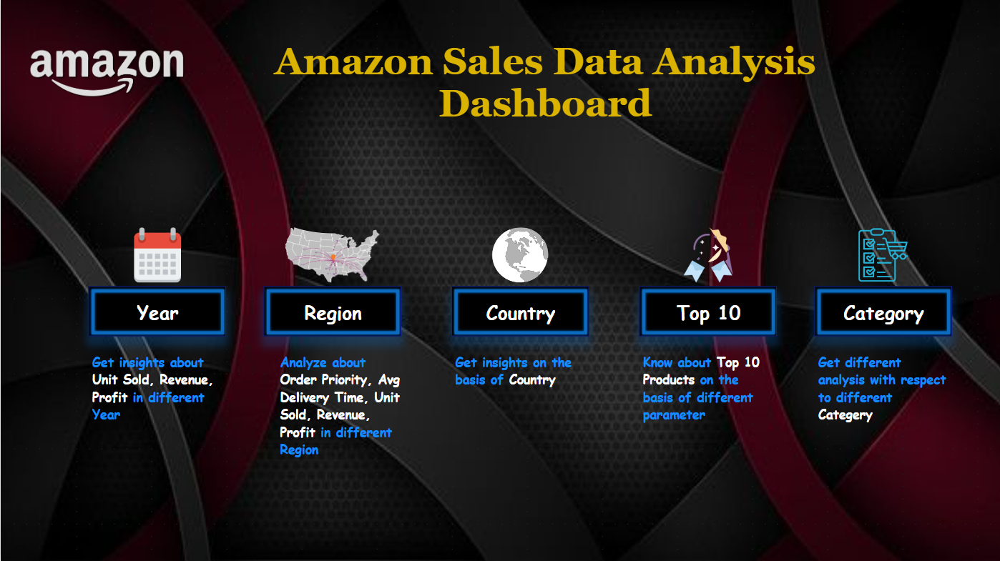
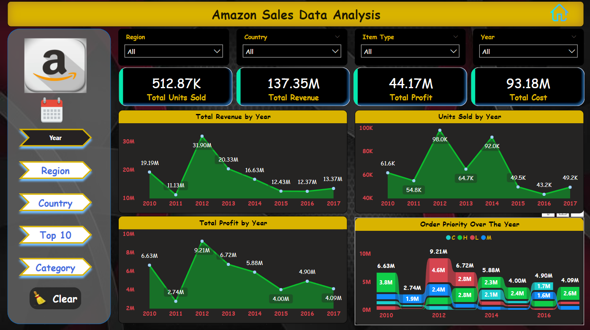

# Amazon Sales Data Analysis Project 📊

## ❓ Problem Statement
##### Sales management has gained importance to meet increasing competition and the need for improved methods of distribution to reduce cost and to increase profits. Sales management today is the most important function in a commercial and business enterprise.ETL process.
##### Do ETL : Extract-Transform-Load some Amazon dataset and find for me
##### Sales-trend -> month wise , year wise , yearly_month wise
##### Find key metrics and factors and show the meaningful relationships between attributes.

### 🛠 Tools Used
    1. Excel
    2. Power BI

# 📉 Dashboard

# ✔️ Conclusion
##### 1. 2012 had the highest Revenue at 31.90M, followed by 2013 at 16.63M and 2010  	at 19.19M and in 2011 had minimum Revenue 11.13M
##### 2. 2012 had the highest Profit at 9.21M, followed by 2013 at 6.72M and 2010 at  	6.63M and in 2011 had minimum Revenue 2.74M
##### 3. Region Sub - Saharan Africa had the highest Revenue and profit of 39.67M and 	12.18M respectively 
##### 4. Bigger the size shows the highest Revenue and Profit in that Country.
##### 5. Cosmetics generated revenue of 36601.51K followed Office Supplies that’s 	30585.38K
##### 6. We had different information for Sales Channels and Order Priority
##### 7. And many more information we got.
